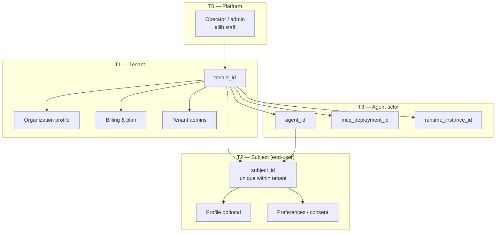
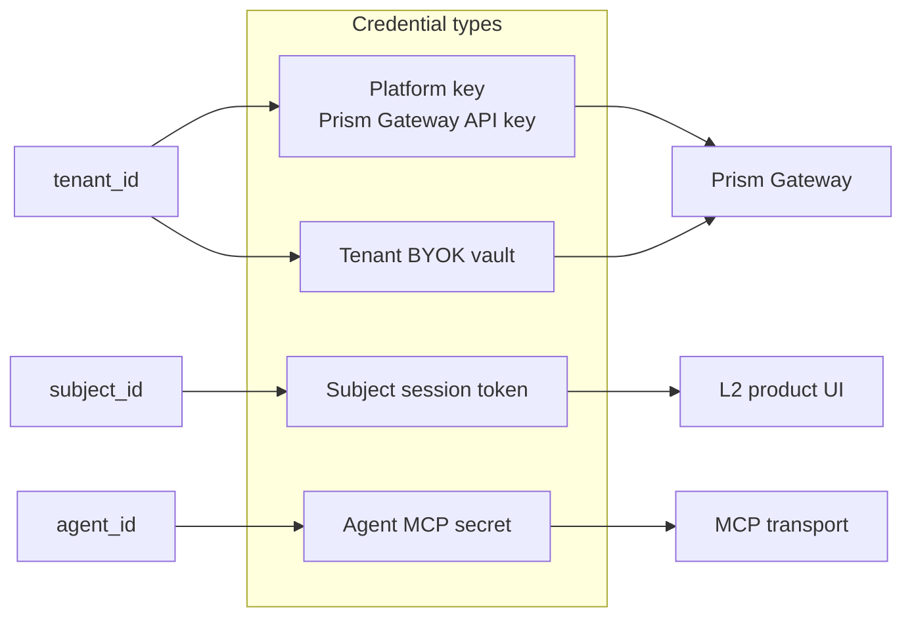
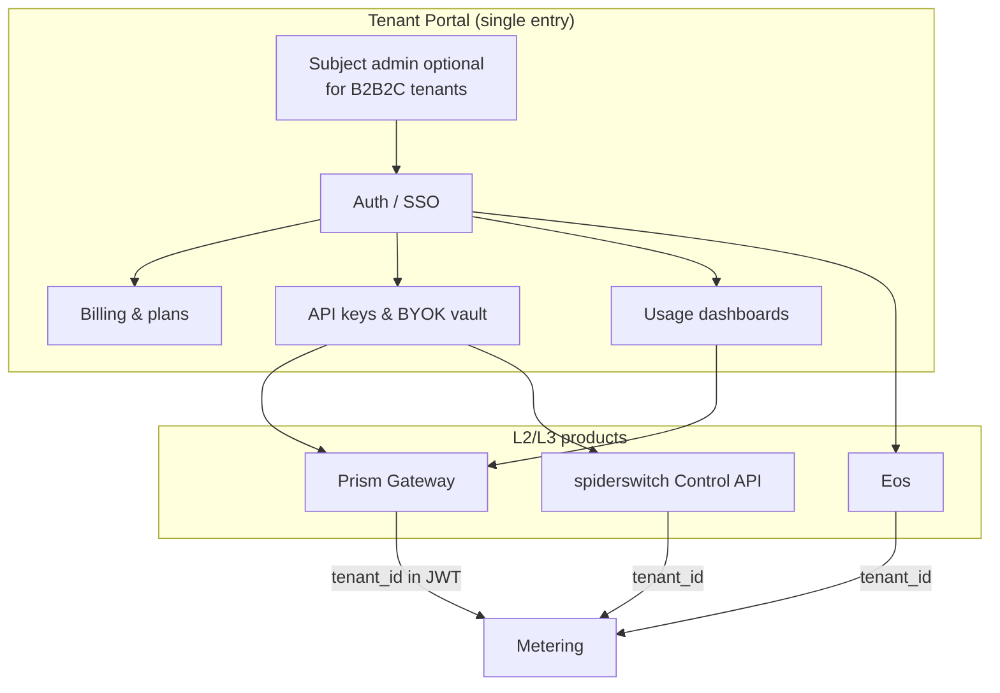
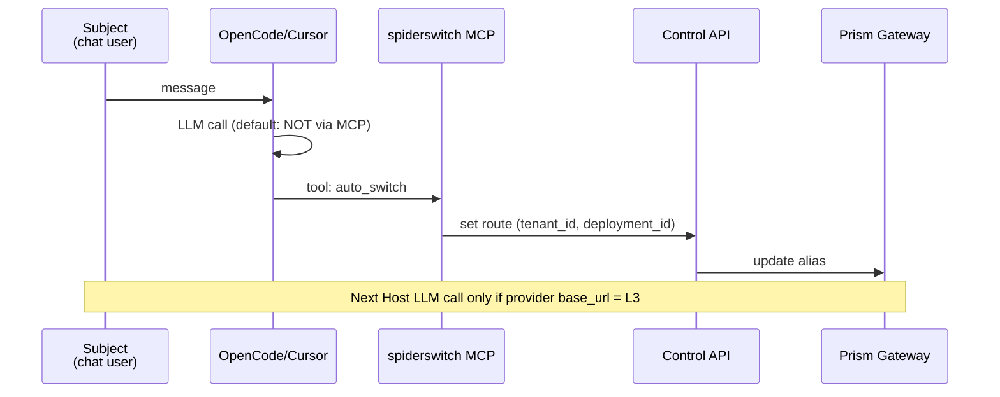

# Identity & Tenancy — Unified User Model

> **Classification:** CONFIDENTIAL · INTERNAL  
> **Version:** 1.0.0  
> **Effective:** 2026-07-01  
> **Parent:** [PRODUCT_LINE_CHARTER.md](./PRODUCT_LINE_CHARTER.md) §7  
> **Identity Owner:** Alex Wang  

## 1. Problem statement

The portfolio serves **multiple customer types** and **multiple end-user contexts**:

- Eos **end-users** (consumers on `eos.ailib.info`)  
- Vela users (developers with Prism API keys)  
- OpenCode/Cursor users running **spiderswitch MCP** (integrator deploys; chat user may not know us)  
- velaclaw operators (BYOK on their machine)  
- aidebate participants (host runs debates)  
- Enterprise tenants (ISV embeds Gateway)  

**Critical distinction:**

> **Tenant** = our contractual / billing customer (or self-serve account holder)  
> **Subject** = tenant's end-user ("用户的用户") — **not** our user to monetize or market to by default  

Without a unified model, we duplicate auth tables, confuse billing, and violate tenant trust.

---

## 2. Identity tiers



### 2.1 Definitions

| Term | ID | Owned by | Stored by us? | Example |
|------|-----|----------|---------------|---------|
| **Operator** | `operator_id` | Platform | Yes (internal) | On-call engineer |
| **Tenant** | `tenant_id` | Platform registry | Yes | Acme ISV, individual dev account |
| **Subject** | `(tenant_id, subject_id)` | **Tenant** (data controller) | Yes, **scoped** | Eos user `u_123` under tenant `eos-consumer` |
| **Agent actor** | `agent_id` | Tenant | Yes | MCP server instance, velaclaw process |
| **Deployment** | `deployment_id` | Tenant | Optional | `spiderswitch` MCP config on integrator VM |

### 2.2 Normative rules

1. **No global end-user identity across tenants** without explicit federation (future exception only).  
2. **Subjects are never billed directly** unless SKU is pure B2C **and** tenant equals subject (e.g. individual Eos consumer = tenant of one).  
3. **Marketing to subjects** requires tenant consent or B2C SKU definition in charter appendix.  
4. **Support tickets** from subjects route through tenant admin when B2B2B.  
5. **GDPR/data export**: tenant is controller for their subjects; we are processor where applicable.  

---

## 3. Tenant types (commercial)

```mermaid
quadrantChart
  title Tenant segmentation (illustrative)
  x Direct relationship with platform
  y Manages own end-users
  quadrant-1 B2C direct (Eos individual)
  quadrant-2 B2B2C platform (ISV)
  quadrant-3 B2B tool (dev tools only)
  quadrant-4 Enterprise private deploy
  Eos consumer: [0.85, 0.3]
  ISV embed: [0.4, 0.9]
  MCP integrator: [0.7, 0.75]
  Enterprise Gateway: [0.5, 0.85]
  Solo dev BYOK: [0.9, 0.1]
```

| Tenant type | `tenant_id` issuer | Typical SKUs | Subject relationship |
|-------------|-------------------|--------------|----------------------|
| **B2C individual** | Eos / Prism signup | L2-EOS, L3-PRISM | Subject = tenant (same person) |
| **Developer self-serve** | Prism API portal | L3-PRISM, L2-VELA | Often no subject; dev is tenant |
| **ISV / Agent platform** | Contract + API | L3-PRISM, L2-SPIDER | Many subjects per tenant |
| **Enterprise** | Contract | L3-PRISM private | Thousands of subjects; SSO via tenant |
| **OSS self-host** | None or optional telemetry opt-in | L2-VELACLAW, L2-SPIDER | Tenant manages entirely offline |

---

## 4. Credential & key model



| Credential | Scope | Issued to | Used for |
|------------|-------|-----------|----------|
| **Prism API key** | `tenant_id` | Tenant admin | L3-PRISM HTTP |
| **BYOK provider key** | `tenant_id` (+ optional env) | Tenant | L3 or DATA-BYOK L2 |
| **Subject session** | `(tenant_id, subject_id)` | Product login | Eos UI, aidebate session |
| **MCP deployment token** | `deployment_id` | Tenant integrator | Authenticate MCP server to Control API |
| **Operator admin** | platform | Alex Wang (platform) | Infra only |

**Rules:**

- BYOK keys **never** cross `tenant_id` boundaries.  
- spiderswitch MCP keys in Cursor config = **tenant integrator's** deployment creds, not subject creds.  
- Subject sees Host LLM behavior; subject does **not** receive Prism API key by default.  

---

## 5. Per-product identity mapping

| Product | Who is tenant? | Who is subject? | Billing entity | Notes |
|---------|----------------|-----------------|----------------|-------|
| **L3-PRISM** | API key holder | Tenant's app users (opaque) | `tenant_id` | Meter on tenant; optional per-subject labels |
| **L2-EOS** | Registered Eos account | Same (B2C) or team members | Account | B2C: tenant=subject |
| **L2-VELA** | Dev with `PRISM_GATEWAY_API_KEY` | Dev / demo user | Key owner | Funnel to L3 |
| **L2-VELACLAW** | Operator running binary | N/A or operator | Self-serve optional | BYOK local |
| **L2-SPIDER** | MCP config owner (integrator) | Agent end-user in Host | Integrator | **Do not** register Host chat users as our subjects unless integrator product requires |
| **L2-AIDEBATE** | Debate host account | Participants | Host | Host owns participant data |
| **L2-SPIDER-PRO** | Pack purchaser | Same as SPIDER | Purchaser | License key → `tenant_id` optional |

---

## 6. Unified management plane (target architecture)



### 6.1 Phased delivery

| Phase | Scope | Outcome |
|-------|-------|---------|
| **IdP-0** | Prism API keys map 1:1 to `tenant_id` | Gateway metering unified |
| **IdP-1** | Tenant portal: keys + usage (no subject admin) | Developer self-serve |
| **IdP-2** | Eos accounts linked to same `tenant_id` namespace | B2C under unified billing |
| **IdP-3** | Subject admin API for ISV tenants | B2B2C: tenant manages their users |
| **IdP-4** | SSO (SAML/OIDC) for enterprise `tenant_id` | Enterprise SKU |

### 6.2 Subject admin (B2B2C) — what we provide vs what tenant owns

| Capability | Platform provides | Tenant owns |
|------------|-------------------|-------------|
| Subject CRUD API | Optional (IdP-3+) | Policy |
| Login UI for subjects | Product-specific (Eos) or tenant-branded | Brand |
| Consent / privacy | Processor DPA | Controller duties |
| Usage per subject | **Reports to tenant** | Business decisions |
| Direct email to subject | **Forbidden** default | — |

---

## 7. spiderswitch & MCP special case



- **Tenant** = organization or individual who installed MCP + holds Prism/Control creds  
- **Subject** = person chatting in Host — **tenant's user**, not invoiced by us  
- **Agent** = automated caller of MCP tools on behalf of session  

**Integrator contract (future):** MCP deployments must pass `tenant_id` + optional `subject_hash` (pseudonym) for audit; we **do not** require PII for subjects.

---

## 8. Data residency & deletion

| Data class | Key | Deletion trigger |
|------------|-----|------------------|
| Tenant account | `tenant_id` | Tenant request |
| Subject profile | `(tenant_id, subject_id)` | Tenant request (controller) |
| Usage events | `tenant_id`, optional `subject_id` | Retention policy per plan |
| Experience index (spiderswitch) | local or cloud per deployment | Tenant controls deployment |
| BYOK secrets | `tenant_id` | Immediate on tenant delete |

---

## 9. Appendix — Identifier formats (recommended)

| ID | Format | Example |
|----|--------|---------|
| `tenant_id` | `ten_` + ULID | `ten_01J...` |
| `subject_id` | opaque per tenant | `sub_01J...` |
| `agent_id` | `agt_` + ULID | `agt_01J...` |
| `deployment_id` | `dep_` + ULID | `dep_01J...` |

---

## 10. Review log

| Date | Version | Change |
|------|---------|--------|
| 2026-07-01 | 1.0.0 | Initial model |

---

*Amend via [GOVERNANCE.md](./GOVERNANCE.md). Do not publish externally.*
