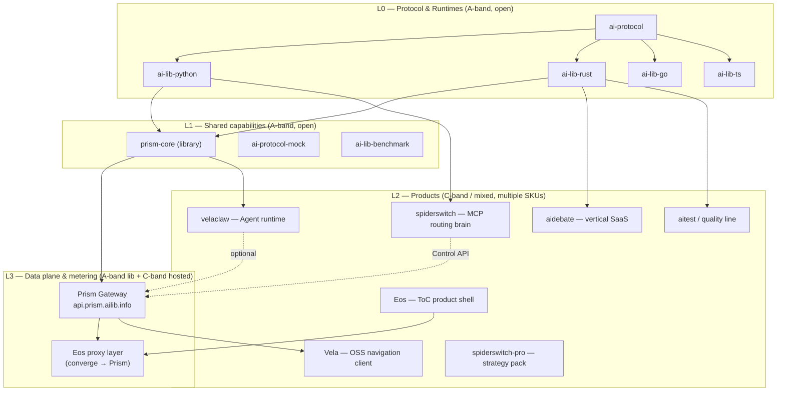
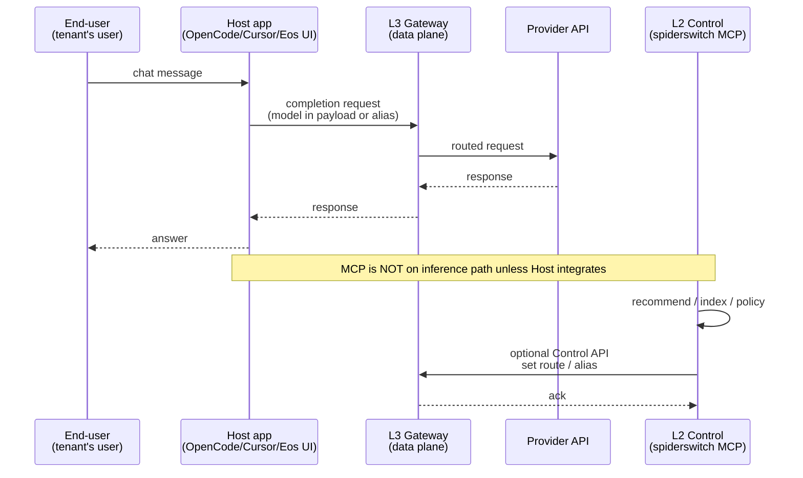
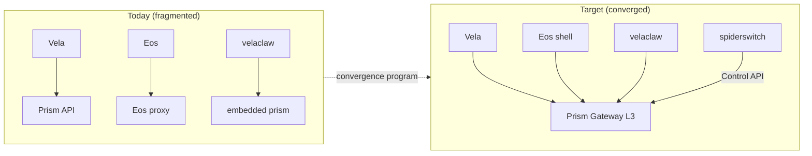
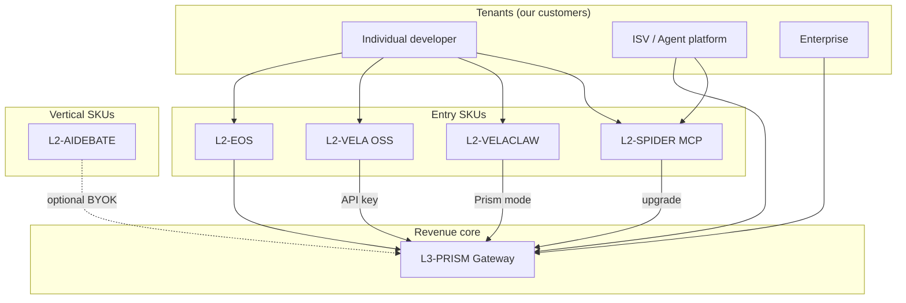
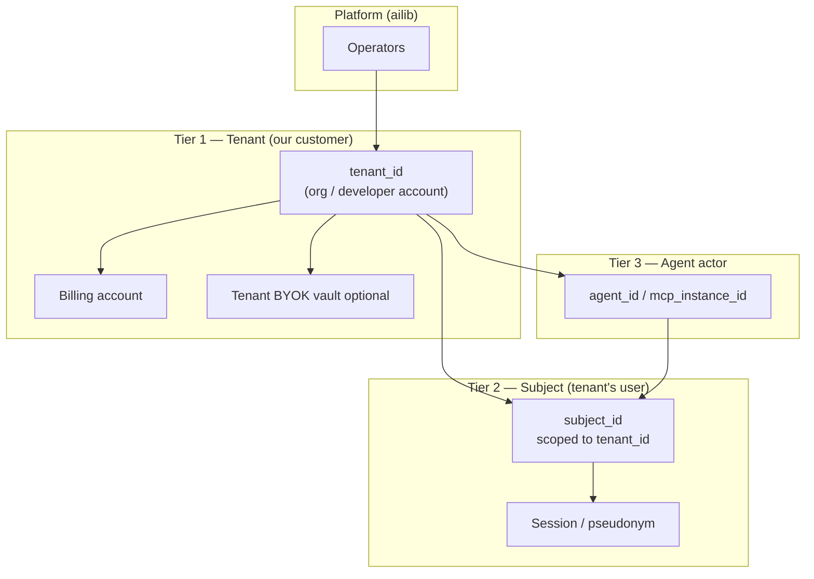

# ai-lib Product Line Charter

> **Classification:** CONFIDENTIAL · INTERNAL  
> **Version:** 1.0.0  
> **Effective:** 2026-07-01  
> **Next review:** 2026-10-01  
> **Supersedes:** Ad-hoc per-repo product narratives  
> **Portfolio Owner:** Alex Wang  
> **Infra Owner:** Alex Wang  
> **Identity Owner:** Alex Wang  
> **Product Owner (L2):** Alex Wang  

**Binding guidance for portfolio decisions.** Public docs must not exceed the promises defined here without a Major amendment ([GOVERNANCE.md](./GOVERNANCE.md)).

---

## 1. Strategic intent

### 1.1 What we are building

**ai-lib** is a **protocol-driven AI infrastructure stack** with **multiple monetizable products (SKUs)** on top—not a single application.

| Principle | Meaning |
|-----------|---------|
| **分散赚钱** | Several independent SKUs; no requirement to buy the whole stack |
| **基建复用** | L0/L1 built once; L2 products integrate via contracts |
| **诚实边界** | Control plane ≠ data plane; MCP ≠ Host LLM selection |
| **租户优先** | We monetize **tenants** (customers); **their end-users** remain theirs ([IDENTITY_AND_TENANCY.md](./IDENTITY_AND_TENANCY.md)) |

### 1.2 What we are not building

- One monolithic “super app” that owns inference, UI, billing, and MCP  
- A universal “install MCP → Host switches model” claim without L3 Gateway  
- Per-product duplicate HTTP proxies without convergence plan  
- A single global user database that treats every chat user as **our** direct customer  

---

## 2. Layer model (normative)



### Layer definitions

| Layer | Role | Monetization | Openness |
|-------|------|--------------|----------|
| **L0** | Spec + language runtimes | Indirect (adoption) | Open source |
| **L1** | Reusable libs (routing engine, mock, bench) | Freemium / support | Open source |
| **L3** | **Data plane**: LLM HTTP forwarding, keys, metering | **Primary**: subscription, usage, SLA | Lib open; hosted C-band |
| **L2** | **Products**: UX, verticals, MCP, agents | Per-SKU: sub, pack, vertical | Mixed |

**Hard rule:** L2 products **must not** create a permanent second L3 without Infra Owner exception (see GOVERNANCE §7).

---

## 3. Control plane vs data plane



| Plane | Examples | Affects Host conversation? |
|-------|----------|----------------------------|
| **Data (L3)** | Prism Gateway, Eos `/api/proxy` (converging) | **Yes** — when Host points provider here |
| **Control (L2)** | spiderswitch MCP, recommend, index | **Only if** L3 route updated **and** Host uses L3 |
| **Vertical app (L2)** | aidebate, velaclaw BYOK | **Yes** — app owns inference path |

---

## 4. SKU catalog (L2 + L3 commercial surfaces)

### 4.1 Master table

| SKU ID | Name | Layer | Inference mode | Primary buyer (tenant) | End-user ("user's user") | Monetization | Status |
|--------|------|-------|----------------|------------------------|---------------------------|--------------|--------|
| `L3-PRISM` | Prism Gateway hosted | L3 | Data plane | Dev team, ISV, enterprise | Tenant's app users | Usage + tier + SLA | Active (API live) |
| `L2-EOS` | Eos | L2 | L3 via Eos shell | Consumer / prosumer | Eos registered users | Subscription | Active |
| `L2-VELA` | Vela web + prism-sdk | L2 | L3 Prism API | Developer (self-host UI) | Developer themselves or demo users | Funnel → L3-PRISM | Active OSS |
| `L2-VELACLAW` | velaclaw runtime | L2 | BYOK direct **or** L1 prism embed | Developer / platform | Agent operators | Pro / hosted runtime | Active (crates.io) |
| `L2-SPIDER` | spiderswitch MCP | L2 | **Control only** default; L3 optional | MCP integrator | Integrator's agent users | Pro pack / team index | Active |
| `L2-SPIDER-PRO` | spiderswitch-pro pack | L2 | Add-on to L2-SPIDER | Same as above | Same | One-time / Gumroad | Active |
| `L2-AIDEBATE` | aidebate | L2 | BYOK via ai-lib-rust | Debate host / edu / media | Debate participants | Vertical sub | Active |
| `L2-AITEST` | Quality & benchmark line | L2 | Test harness | Engineering org | N/A (B2B tool) | Reports / CI | Merge w/ benchmark |
| `L1-PRISM-CORE` | prism-core crate | L1 | Library embed | Platform builders | Their users | Support / enterprise license | Pre-publish |

### 4.2 Inference mode legend (required on every new SKU)

| Code | Meaning | Example |
|------|---------|---------|
| `DATA-L3` | All LLM traffic via Prism Gateway | Vela |
| `DATA-OWN` | Product runs own proxy (must converge) | Eos (legacy path) |
| `DATA-BYOK` | Product calls providers with tenant keys | velaclaw, aidebate |
| `DATA-EMBED` | Embeds L1 prism in process | velaclaw Prism mode |
| `CTRL-ONLY` | No Host inference path; decision/index only | spiderswitch default |
| `CTRL+L3` | Control product + Gateway Control API | spiderswitch target mode |

### 4.3 Promise matrix (what we may claim publicly)

| Claim | Allowed for SKU | Forbidden for |
|-------|-----------------|---------------|
| "Switch model for **this app's** replies" | DATA-* L2, L3 | CTRL-ONLY alone |
| "Recommend / index / route policy" | L2-SPIDER, L1 | — |
| "Hosted multi-provider gateway" | L3-PRISM | Individual MCP tools |
| "Your users keep their accounts" | All | Implying we own end-user relationship |

---

## 5. Gateway convergence (architecture debt — mandatory track)

**Problem:** Today multiple data paths exist (`api.prism.ailib.info`, Eos `/api/proxy`, embedded prism in velaclaw).



| Milestone | Deliverable | Owner |
|-----------|-------------|-------|
| M1 | Publish `prism-core` + Control API spec | Alex Wang |
| M2 | Eos proxy delegates to Prism (or shared crate) | Alex Wang |
| M3 | spiderswitch `switch_model` → Control API when `routing_mode=gateway` | Alex Wang |
| M4 | Deprecation notice for duplicate proxy configs | Alex Wang |

Until M3, **L2-SPIDER default public claim = control / recommendation only**.

---

## 6. Product interaction map (cross-sell, not merge)



**Cross-sell rules:**

- CTRL-ONLY products **must** document upgrade path to L3-PRISM  
- L3-PRISM **must not** require a specific L2 client  
- Vertical products **may** ignore MCP entirely  

---

## 7. Identity & tenancy (summary)

Full model: [IDENTITY_AND_TENANCY.md](./IDENTITY_AND_TENANCY.md).



**Normative:**

- **`tenant_id`** — required on all L3 metering and paid L2 features  
- **`subject_id`** — end-user within tenant; **we do not market to subjects directly** without tenant consent  
- **Billing** attaches to `tenant_id`; subject-level metering is **reporting to tenant**, not invoicing subject  
- **BYOK** keys belong to tenant unless product explicitly supports subject-owned keys (document per SKU)  

---

## 8. Roadmap priorities (portfolio-level)

| Priority | Initiative | Rationale |
|----------|------------|-----------|
| **P0** | Gateway convergence program (§5) | Unblocks honest "switch model" story |
| **P0** | Identity plane v1 (`tenant_id` on Prism) | Unified B2B2C management |
| **P0** | Charter-aligned public messaging audit | Stop over-promise |
| **P1** | prism-core publish + Control API | L1/L3 accessible |
| **P1** | spiderswitch `effective_scope` + gateway backend | Control/data linkage |
| **P1** | Merge aitest / benchmark narrative | Reduce SKU noise |
| **P2** | velaclaw / ZeroSpider brand unify | Channel clarity |
| **P2** | Eos vs Vela funnel metrics | Measure L2→L3 conversion |

---

## 9. Appendix A — New SKU intake template

Copy into PR when proposing a new product:

```markdown
### SKU proposal
- **SKU ID:** L2-____
- **Name:**
- **Layer:** L0 | L1 | L2 | L3
- **Inference mode:** DATA-L3 | DATA-BYOK | CTRL-ONLY | ...
- **Tenant type:** developer | enterprise | consumer-via-partner
- **End-user:** who is "user's user"? relationship owner?
- **Monetization:**
- **L3 dependency:** required | optional | none
- **Public promise (1 sentence):**
- **Explicit non-promise:**
```

---

## 10. Appendix B — Review log

| Date | Version | Change | Approver |
|------|---------|--------|----------|
| 2026-07-01 | 1.0.0 | Initial charter | Alex Wang |

---

## 11. Appendix C — Exceptions log

| ID | SKU | Exception | Expires | Owner |
|----|-----|-----------|---------|-------|
| — | — | — | — | — |

---

*Changes: follow [GOVERNANCE.md](./GOVERNANCE.md). Do not publish externally.*
